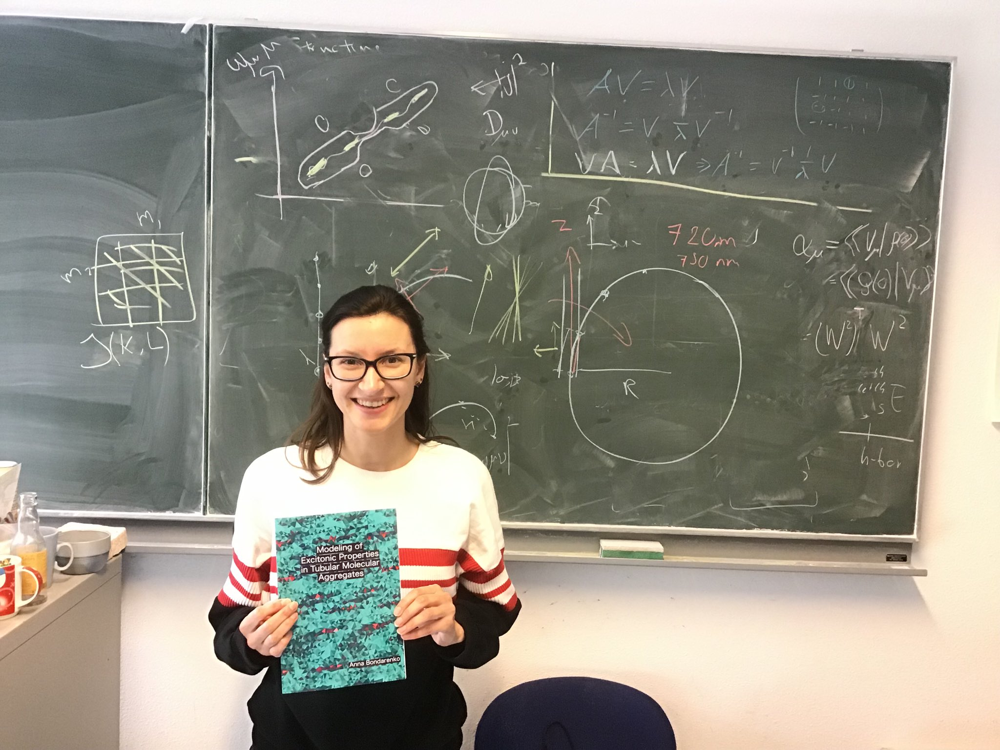

I am a postdoctoral researcher in the [Tempelaar Team](https://tempelaar.chem.northwestern.edu/),
part of the [Chemistry Department of Northwestern University](https://chemistry.northwestern.edu/).
Previously, I obtained my PhD followed by a short postdoctoral appointment working with
[Prof. Jasper Knoester](https://www.rug.nl/staff/j.knoester/) and 
[Prof. Thomas La Cour Jansen](https://www.rug.nl/staff/t.l.c.jansen/) 
at the [Zernike Institute for Advanced Materials](https://www.rug.nl/research/zernike/), 
[University of Groningen](https://www.rug.nl/) (Netherlands). Before that, I have obtained
the MSc in Theoretical Chemistry and Computational Modelling 
([TCCM](https://www.emtccm.org/)) at the [University of Porto](https://sigarra.up.pt/up/en) (Portugal). 

News
======
2020 May 19 - The "exciton (de)localization" chapter of my thesis, formerly 
on the [arxiv](https://arxiv.org/abs/2003.10355), is now out on [JCP](https://aip.scitation.org/doi/10.1063/5.0008688)!

2020 Mar 23 - Another chapter of my thesis on the way to being published - now on the [arxiv](https://arxiv.org/abs/2003.10355).

2019 Oct 11 - Milestone achieved: successfully defended my [PhD thesis](https://doi.org/10.33612/diss.98528598)!!! 

2019 Sep 30 - Happy to have my [PhD thesis](https://doi.org/10.33612/diss.98528598) printed! 

2019 Aug 26 - Our paper on exciton dynamics in multichromophoric systems has been published 
online in [Chem. Phys.](https://www.sciencedirect.com/science/article/pii/S0301010419305968)! 

