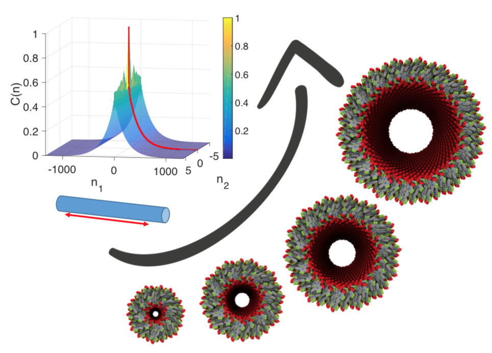
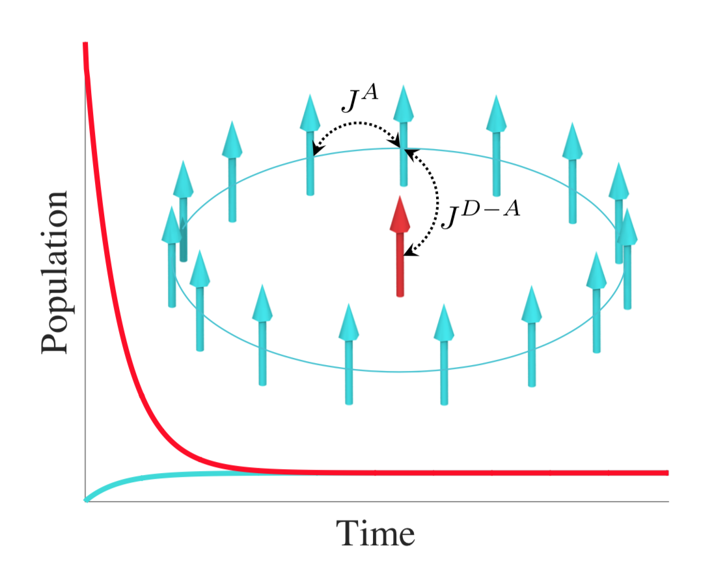

## Test

For my publications, see the [Publications](https://scholar.google.com/citations?user=y-6o3X0AAAAJ) tab. Feel free to contact me in case you don't have access to any of the papers. Here, I describe some of my research interests.

#### Synthetic light-harvesting complexes

    
 During my PhD studies, I modeled large tubular aggregates of cyanine dyes, which are synthetic analogues of chlorosomes, and explained optical changes observed in their absorption spectra <a href="https://pubs.acs.org/doi/abs/10.1021/acs.jpclett.7b00967">[J. Phys. Chem. Lett. 2017</a>. I expanded these finding into a systematic study of aggregate size effects on optical and electronic properties to get insights into design rules for molecular electronics <a href="https://arxiv.org/abs/2003.10355">[arxiv preprint 2020]</a>. 

    

#### Intermolecular energy transfer

    

    
 Recently, we have comprehensively compared three computational models for energy transfer in multichromophoric complexes <a href="https://www.sciencedirect.com/science/article/pii/S0301010419305968">[Chem. Phys. 2020]</a>. 

