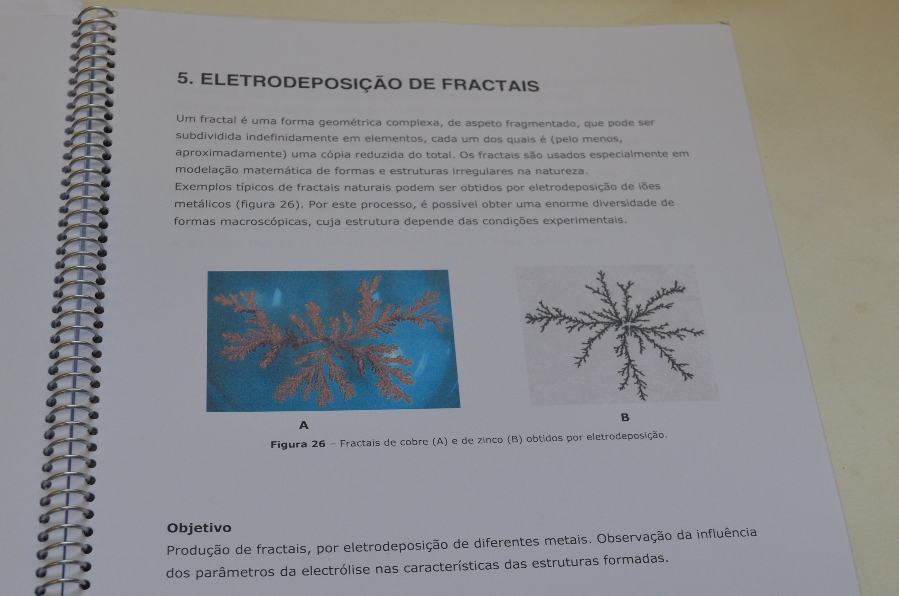
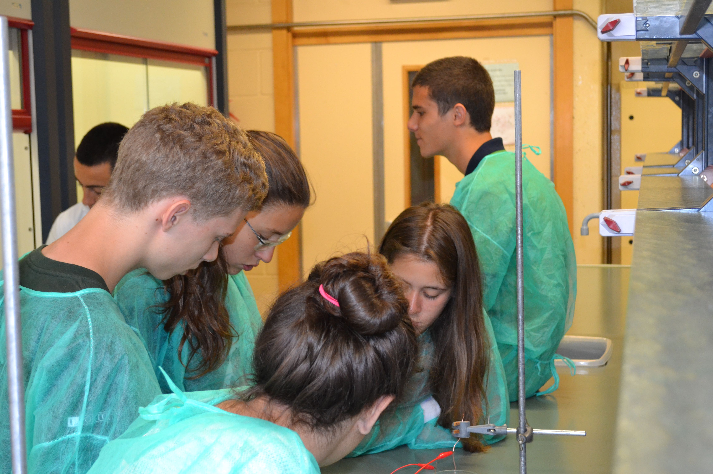
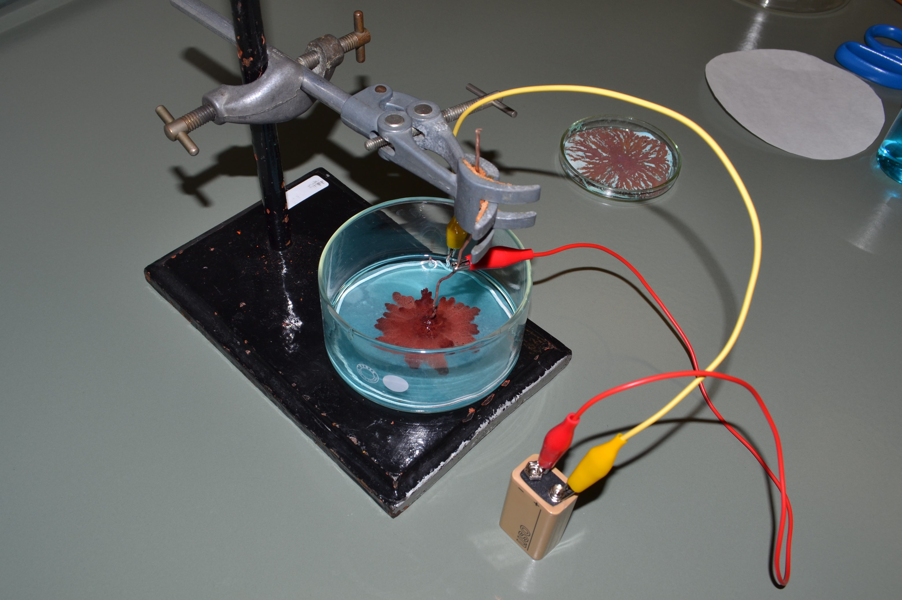
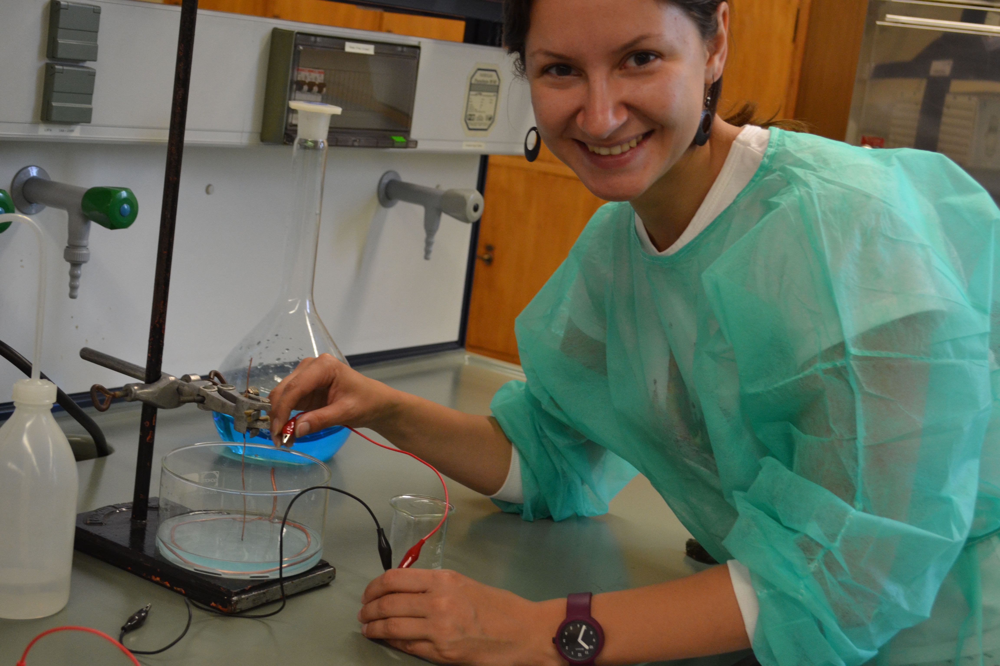

Since early 2019, I am actively involved in the monthly meetings of the 
**Female Scientific Network** at the Faculty of Science and Engineering of the University of Groningen.

I am a registered scientist in **Request a Woman in STEMM**, 
a public-facing database of women scientists around the world.
Here's [my profile](https://request500womenscientists.org/profile/14098).

I participate in the [**Skype a Scientist**](https://www.skypeascientist.com/) program 
that matches scientists with classrooms worldwide.
You can find me through the [search tool](https://confirm.skypeascientist.com/search).

And here some pictures of me and (high-)school students having some fun at the
**Chemistry is fun** summer camp in Porto, Portugal, in 2013: 

  
  

  
  

