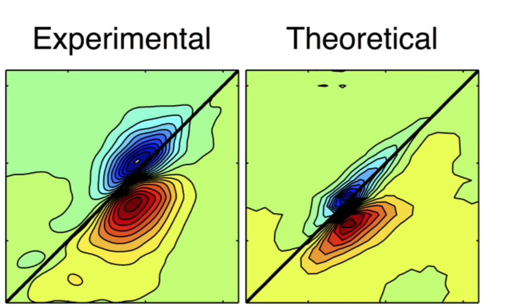
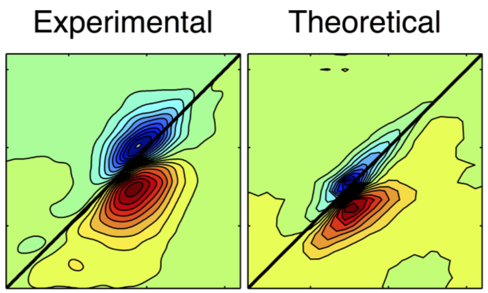

For my publications, please see my [Google Scholar profile](https://scholar.google.com/citations?user=y-6o3X0AAAAJ). 
Feel free to contact me in case you do not have access to (some of) my articles. 
Here, I describe some of my research with a bit of narrative and context.

## Synthetic light-harvesting complexes

    

    
 During my PhD studies, I modeled large tubular aggregates of cyanine dyes, which are synthetic analogues of chlorosomes. We explained optical changes observed in their absorption spectra <a href="https://pubs.acs.org/doi/abs/10.1021/acs.jpclett.7b00967">[J. Phys. Chem. Lett. 2017</a>. 

We expanded these findings into a systematic study of aggregate size effects on optical and electronic properties to get insights into design rules for molecular electronics <a href="https://arxiv.org/abs/2003.10355">[arxiv preprint 2020]</a>. 

## Modeling of nonlinear spectroscopy

    

    
 As part of my master's project, we developed a benchmark method to probe protein conformational changes based on two-dimensional infrared spectra <a href="https://aip.scitation.org/doi/abs/10.1063/1.4919716">[J. Chem. Phys. 2015]</a>. 

## Intermolecular energy transfer

    

    
 Recently, we have comprehensively compared three computational models for energy transfer in multichromophoric complexes <a href="https://www.sciencedirect.com/science/article/pii/S0301010419305968">[Chem. Phys. 2020]</a>. 

-----------------------

## Modeling of nonlinear spectroscopy

    

    
 As part of my master's project, we developed a benchmark method to probe protein conformational changes based on two-dimensional infrared spectra <a href="https://aip.scitation.org/doi/abs/10.1063/1.4919716">[J. Chem. Phys. 2015]</a>. 

